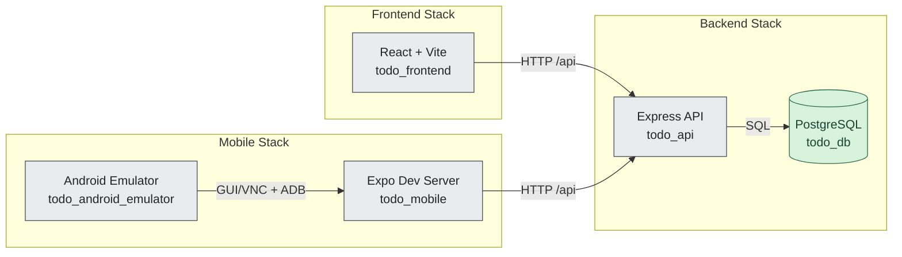
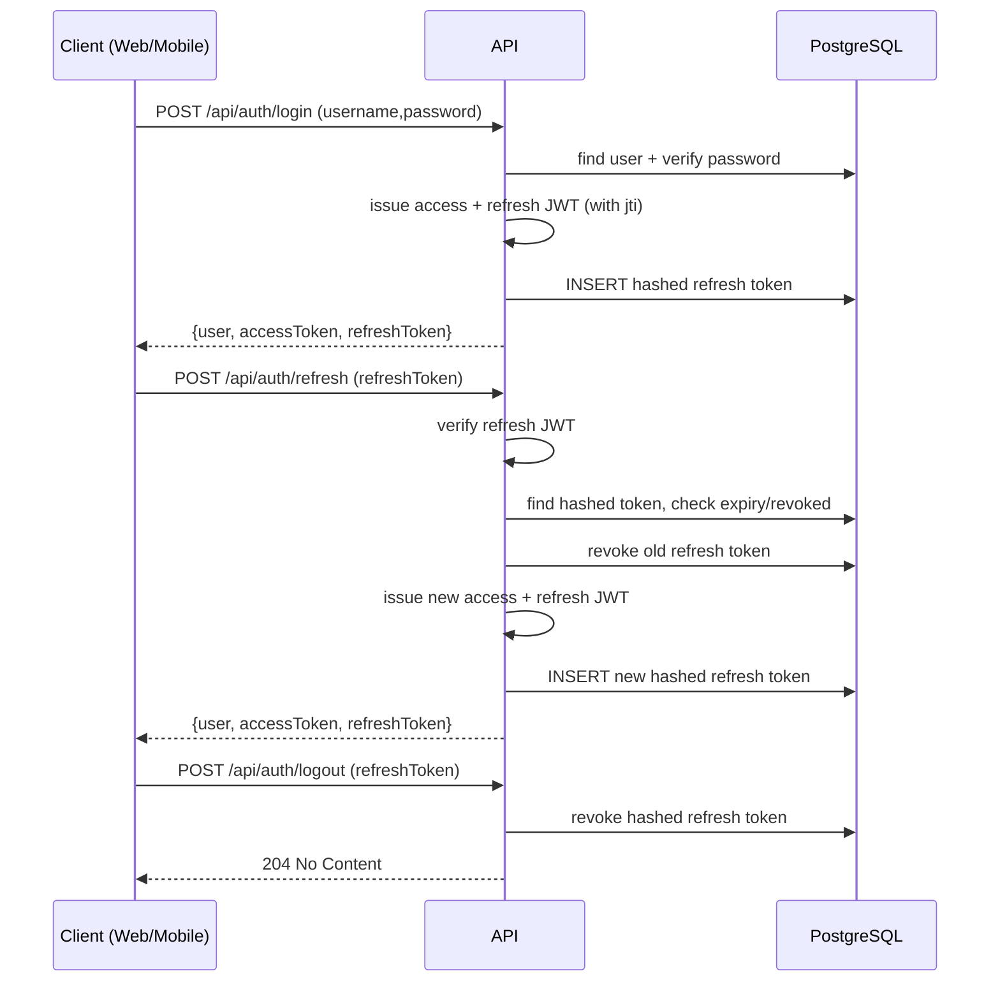
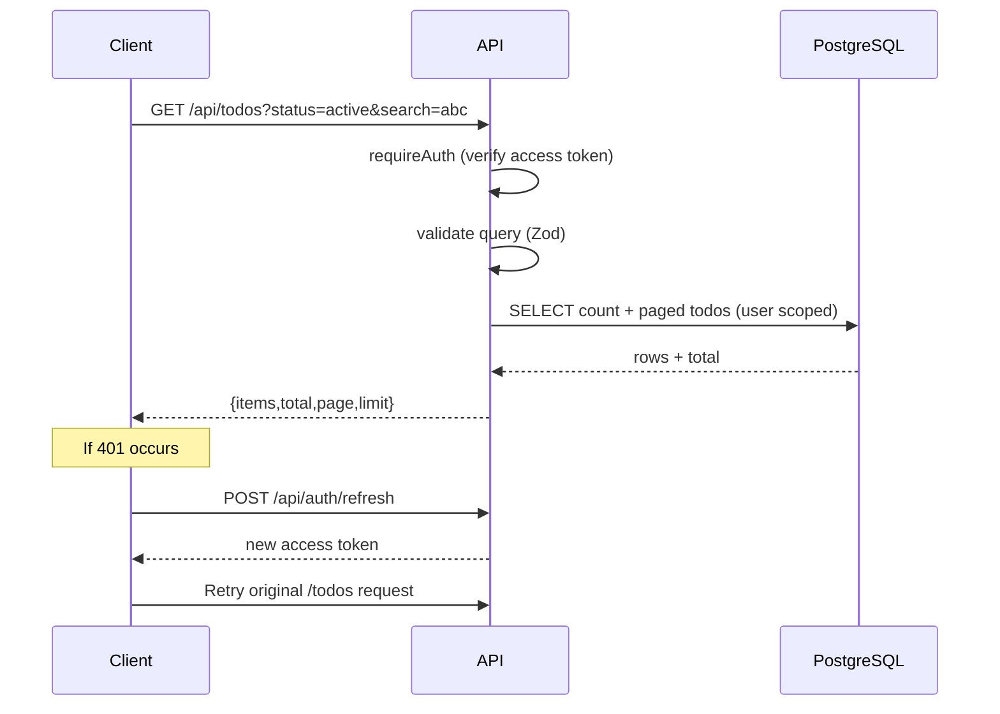
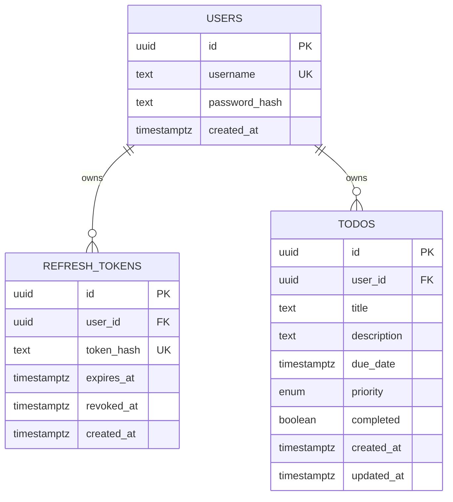

# Docker Workshop Todo Platform

A full-stack, multi-user Todo platform built as a monorepo with three runnable app stacks:
- Backend API (`Express + PostgreSQL + JWT auth`)
- Web frontend (`React + Vite + React Query`)
- Mobile client (`Expo React Native`)

Everything is containerized and connected via explicit Docker networks so each surface (web/mobile) can reach the API while the database stays isolated.

## Table of Contents
- [1. Architecture Overview](#1-architecture-overview)
- [2. Repository Structure](#2-repository-structure)
- [3. Runtime Topology (Docker + Networks)](#3-runtime-topology-docker--networks)
- [4. How the System Works End-to-End](#4-how-the-system-works-end-to-end)
- [5. Backend Design](#5-backend-design)
- [6. Web Frontend Design](#6-web-frontend-design)
- [7. Mobile Design](#7-mobile-design)
- [8. Data Model](#8-data-model)
- [9. API Reference](#9-api-reference)
- [10. Environment Variables](#10-environment-variables)
- [11. Local Development Runbook](#11-local-development-runbook)
- [12. Testing and Validation](#12-testing-and-validation)
- [13. Troubleshooting](#13-troubleshooting)
- [14. Logs and Engineering History](#14-logs-and-engineering-history)

## 1. Architecture Overview

### High-level responsibilities
- `backend/`: Auth + todo business logic, migrations, persistence.
- `frontend/`: Browser UI with local session persistence and token refresh retry.
- `mobile/`: React Native UI with AsyncStorage session persistence and token refresh retry.
- Root compose files: isolate concerns by stack (`backend`, `frontend`, `mobile`).

### Core features implemented
- Username/password authentication
- JWT access + refresh token flow with rotation
- Logout revocation flow
- Per-user todo isolation
- Todo CRUD: create/read/update/delete
- Todo filters: status, priority, search
- Optional due date + priority metadata

## 2. Repository Structure

```text
.
|-- backend/
|   |-- src/
|   |   |-- app.ts, server.ts
|   |   |-- config/env.ts
|   |   |-- db/ (pool, migrations)
|   |   |-- middleware/ (auth, error handling)
|   |   |-- modules/
|   |   |   |-- auth/ (controller/service/repository)
|   |   |   `-- todos/ (controller/service/repository)
|   |   |-- routes/ (authRoutes, todoRoutes)
|   |   |-- utils/ (jwt, hash, password, httpError)
|   |   `-- validation/ (zod schemas)
|   |-- sql/001_init.sql
|   `-- tests/ (unit + integration with pg-mem)
|-- frontend/
|   `-- src/
|       |-- api/client.ts
|       |-- context/AuthContext.tsx
|       |-- components/*
|       |-- pages/TodoDashboard.tsx
|       `-- styles/main.css
|-- mobile/
|   `-- src/
|       |-- api/client.ts
|       |-- context/AuthContext.tsx
|       |-- screens/AuthScreen.tsx
|       `-- screens/TodoScreen.tsx
|-- docker-compose.backend.yml
|-- docker-compose.frontend.yml
|-- docker-compose.mobile.yml
|-- .env.example
`-- .github/logs/
```

## 3. Runtime Topology (Docker + Networks)

The platform uses **three external Docker networks**:
- `backend_net`: DB <-> API only
- `frontend_backend_net`: Frontend <-> API
- `mobile_backend_net`: Mobile/Emulator <-> API

The API container is the bridge attached to all three.



## 4. How the System Works End-to-End

### Startup lifecycle
1. Create external networks (`backend_net`, `frontend_backend_net`, `mobile_backend_net`).
2. Start backend compose:
   - `db` starts and passes healthcheck.
   - `api` runs `npm install && npm run migrate && npm run dev`.
3. Start frontend compose (`vite` dev server on port `5173`).
4. Optionally start mobile compose (`expo` + Android emulator).

### Request lifecycle summary
1. User authenticates (`/auth/register` or `/auth/login`).
2. API returns `accessToken` + `refreshToken`.
3. Client calls `/todos` with `Authorization: Bearer <accessToken>`.
4. On access token expiry (`401`), client calls `/auth/refresh`, stores new token pair, and retries original request.
5. On logout, client calls `/auth/logout` with refresh token and clears local session.

## 5. Backend Design

### Stack and structure
- Node.js + TypeScript + Express
- Zod for runtime request validation
- PostgreSQL (`pg`) for persistence
- JWT (`jsonwebtoken`) for access/refresh tokens
- Password hashing via `bcryptjs`
- Refresh token hashing via SHA-256 before DB storage

### Layering
- `Routes`: endpoint wiring
- `Controllers`: parse/validate request + shape HTTP response
- `Services`: business rules and auth/todo workflows
- `Repositories`: SQL execution and persistence mapping

### Security model
- Access tokens verified by `requireAuth` middleware on `/api/todos/*`
- Refresh tokens:
  - signed JWT with `type=refresh`
  - hashed in DB
  - revoked on refresh rotation and logout
- Token uniqueness includes `jti` claim (`randomUUID`) to avoid collisions

### Auth sequence (rotation)



### Todo request flow



## 6. Web Frontend Design

### Stack
- React 18 + TypeScript + Vite
- TanStack React Query for server-state and cache invalidation
- Local storage auth session persistence

### Behavior
- `AuthContext` stores `{user, accessToken, refreshToken}` in `localStorage`
- `TodoDashboard` wraps API calls with `runWithAuthRetry`:
  - if API returns `401`, refresh token and retry once
- Todo UI capabilities:
  - add, edit, delete, toggle completion
  - filter by status, priority, search text
  - due date conversion between local input and UTC ISO

### Visual system
- Custom immersive CSS theme
- Responsive layout with mobile breakpoints
- Priority badges (`low/medium/high`) with distinct styles

## 7. Mobile Design

### Stack
- Expo SDK 52 + React Native
- AsyncStorage-backed session persistence
- Shared API contract with backend

### Behavior
- App boot:
  - loads persisted session from AsyncStorage
  - renders `AuthScreen` or `TodoScreen`
- API calls wrapped with auth retry:
  - refresh on `401`, retry original request
- Todo features available on mobile:
  - create, list, update, delete
  - toggle completion
  - priority cycling
  - status/search/priority filtering

### Emulator integration
- `docker-compose.mobile.yml` includes:
  - `todo_mobile` (Expo)
  - `todo_android_emulator` (`budtmo/docker-android`)
- noVNC endpoint: `http://localhost:6080`

## 8. Data Model



## 9. API Reference

Base URL: `/api`

### Health
- `GET /health`

### Auth
- `POST /auth/register`
- `POST /auth/login`
- `POST /auth/refresh`
- `POST /auth/logout`

Auth body shape:
```json
{
  "username": "alice_user",
  "password": "password123"
}
```

Refresh/logout body shape:
```json
{
  "refreshToken": "<jwt>"
}
```

### Todos (Bearer token required)
- `GET /todos`
- `POST /todos`
- `GET /todos/:id`
- `PUT /todos/:id`
- `DELETE /todos/:id`

Supported query filters on `GET /todos`:
- `status=all|active|completed`
- `priority=low|medium|high`
- `search=<text>`
- `dueFrom=<ISO datetime>`
- `dueTo=<ISO datetime>`
- `page=<positive int>`
- `limit=<1..100>`
- `sortBy=createdAt|dueDate|priority`
- `sortOrder=asc|desc`

Create/update payload fields:
- `title` (required for create)
- `description` (nullable)
- `dueDate` (nullable ISO datetime)
- `priority` (`low|medium|high`)
- `completed` (boolean)

## 10. Environment Variables

Create `.env` from `.env.example`.

### Shared
- `NODE_ENV=development`

### Backend
- `API_PORT=4000`
- `POSTGRES_DB=tododb`
- `POSTGRES_USER=todouser`
- `POSTGRES_PASSWORD=todopassword`
- `POSTGRES_PORT=5432`
- `DATABASE_URL=postgres://todouser:todopassword@db:5432/tododb`
- `ACCESS_TOKEN_SECRET=<min length 16>`
- `REFRESH_TOKEN_SECRET=<min length 16>`
- `ACCESS_TOKEN_TTL=15m`
- `REFRESH_TOKEN_TTL_DAYS=7`

### Frontend
- `VITE_API_URL=http://api:4000/api` (container-network URL)
- `VITE_API_URL_BROWSER=http://localhost:4000/api` (browser localhost URL)
- `FRONTEND_PORT=5173`

### Mobile
- `EXPO_PUBLIC_API_URL=http://api:4000/api`
- `EXPO_PUBLIC_API_URL_HOST=http://localhost:4000/api`
- `EXPO_DEVTOOLS_PORT=19002`
- `EXPO_METRO_PORT=8081`
- `EXPO_WEB_PORT=19006`
- `ANDROID_EMULATOR_DEVICE=Samsung Galaxy S10`
- `ANDROID_EMULATOR_API=33`

## 11. Local Development Runbook

### Prerequisites
- Docker + Docker Compose
- Node.js 20+ (for local workspace scripts)

### 1) Create env file
```powershell
Copy-Item .env.example .env
```

### 2) Create external networks
```powershell
npm run networks:create:ps
```

### 3) Start backend stack
```powershell
docker compose -f docker-compose.backend.yml up -d --build
```

### 4) Start frontend stack
```powershell
docker compose -f docker-compose.frontend.yml up -d --build
```

### 5) Start mobile stack (optional)
```powershell
docker compose -f docker-compose.mobile.yml up -d --build
```

### Access points
- Web app: `http://localhost:5173`
- API health: `http://localhost:4000/api/health`
- Android emulator (noVNC): `http://localhost:6080`
- Expo/Metro ports: `19000`, `19001`, `19002`, `8081`, `19006`

### Stop stacks
```powershell
docker compose -f docker-compose.mobile.yml down
docker compose -f docker-compose.frontend.yml down
docker compose -f docker-compose.backend.yml down
```

Remove DB persisted data too:
```powershell
docker compose -f docker-compose.backend.yml down -v
```

## 12. Testing and Validation

### Backend
```powershell
cd backend
npm test
npm run build
```
- Unit tests: service-level auth/todo behavior
- Integration tests: API workflows using `pg-mem`

### Frontend
```powershell
cd frontend
npm test
npm run build
```

### Mobile
```powershell
cd mobile
npm test
```

## 13. Troubleshooting

### 1) SQL migration fails near `?CREATE` or `\uFEFFCREATE`
Cause: UTF BOM in `backend/sql/001_init.sql`.
Fix: rewrite the SQL file as BOM-free/ASCII, then restart backend stack.

### 2) Tooling parse error in JSON (`Unexpected token '\uFEFF'`)
Cause: UTF BOM in JSON file.
Fix: rewrite the JSON file in BOM-free encoding.

### 3) Frontend test/build config conflicts between Vite and Vitest
Fix: keep separate config files:
- `frontend/vite.config.ts`
- `frontend/vitest.config.ts`

### 4) Android emulator performance issues on Windows
Cause: host virtualization/GPU constraints.
Fix: keep Expo in Docker and run emulator on host as fallback.

## 14. Logs and Engineering History

Detailed implementation logs are tracked under `.github/logs/`:
- `.github/logs/README.md` (index)
- `.github/logs/2026-04-18-master-retrospective.md` (full retrospective)
- milestone logs for architecture, backend, frontend/mobile, validation, runtime checks, docs sync

These logs record key implementation decisions, validation runs, and root-cause/fix history.
